# **오픈소스소프트웨어**

### Introduction
* 담당교수: 최광훈
* 담당학과: 인공지능학부
* 강의실: AI융합-106
* 강의시간: 월1월2수1
-------------
### Week1-1 강의 개요 (강의계획서)
* 플립러닝 방식 수업
  1. 미리 동영상을 공부
  2. 매 강의 시작하면 10분 퀴즈 진행
  3. 요약 강의
  4. 연습문제 풀이 진행
  
* 수업평가
  * 중간고사: 30
  * 기말고사: 40
  * 수업참여도: 5
  * 출석: 5

-------------
### Week1-2 오픈소스소프트웨어 개요
* _The State of Open Source Software(OSS)_
  * [**_'Octoverse' at GitHub_**](https://octoverse.github.com/)
* _What is Open Source Software_?  
  소프트웨어 저작권 소유자가 모든 사람에게 소스 코드를   
  게시, 사용, 복사, 수정 및 배포할 권리를 부여한 소프트웨어
* OSS License
  * What is Open Source Software License?  
    오픈소스 소프트웨어의 사용, 복제, 수정, 배포 권한의 범위를 지정  
  * Examples
    1. GPL (GNU General Public License)  
    2. LGPL (GNU Lesser General Public License)  
    3. MIT License  
    4. BSD License  
    5. Apache License  
    6. MPL (Mozilla Public License)
  * OSS License 비교
    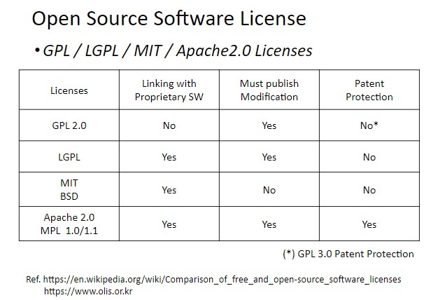
-------------
### Week2-1 버전 관리 개요
* Version Control System (VCS)  
  이전 작업 버전으로 쉽게 돌아가기 위한 시간 경과에 따른 파일 추적
* General Actions in VCS
  * Checkin  
    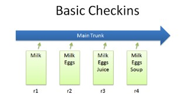
  * Checkout and editing  
    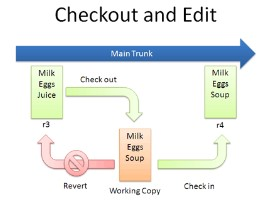
  * Diffs  
    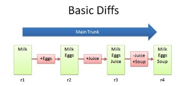
  * Branching  
    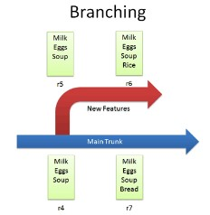
  * Merging  
    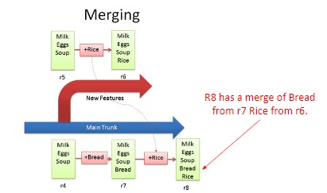
  * Conflicts  
    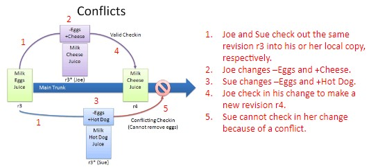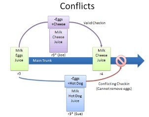
  * Tagging  
    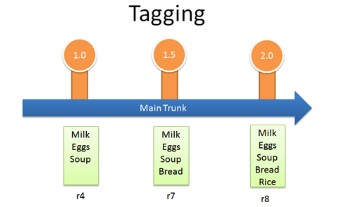
* Two Main Types of VCS
  1. Centralized VCS (중앙 버전 제어 시스템)  
    * 하나의 중앙 저장소(repository)를 사용하여 여러 사용자가 파일 및 코드 버전 관리를 하는 시스템
    * E.g., CVS, SVN, Darcs
  2. Decentralized (Distributed) VCS (분산 버전 제어 시스템)
    * 각 사용자가 자신의 로컬 저장소를 소유하고 별도의 원격(중앙) 저장소가 있는 시스템  
    * 새로운 두 가지 동작 (with remote repositories):  
    fork, pull request  
    * E.g., GIT, Mercurial

-------------
### Week2-2 Git
* Git  
  : Git 개발과정, 소스파일 등을 관리하는 도구  
    History 관리가 되어 개발되어온 과정, 역사를 볼 수 있고, 특정 시점으로 복구 가능
* A distributed version control system  
  * Workspace: 현재 작업중인 파일들이 있는 곳
  * Index: 다음 커밋에 포함될 파일들을 선택하고 준비하는 단계
  * Local repository: 커밋된 파일들이 저장되는 로컬 저장소
  * Remote repository: 로컬 저장소와 비교적 더 넓은 범위의 개발자 또는 팀원들과 파일을 공유하기 위한 저장소 (로컬 저장소에서 변경사항을  원격 저장소로 push하여 공유)

* Workflow
  * git clone: 원격 저장소로부터 프로젝트의 복사본을 만드는 데 사용
  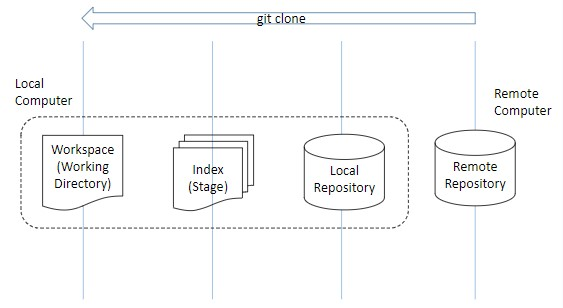
  * git add: 작업 workspace에 있는 파일을 index에 추가
  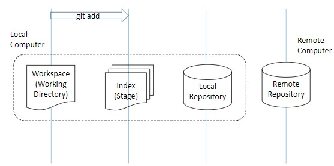
  * git commit: index에 있는 변경 내용을 local repository에 영구적으로 기록 (네트워크를 이용하지 x)
  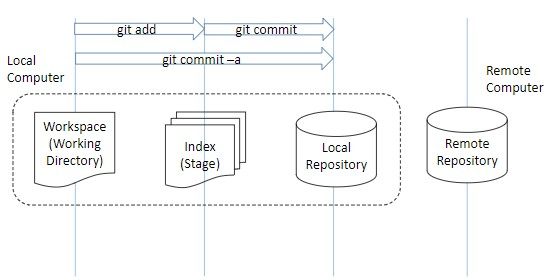
  * git push: local repository에 있는 변경 내용을 remote repository로 업로드
  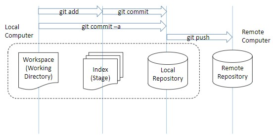
  * git fetch: remote repository에서 변경 내용을 가져오는 명령어
  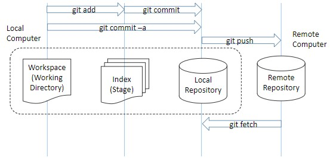
  * git merge: local branch와 가져온 변경 내용을 병합
  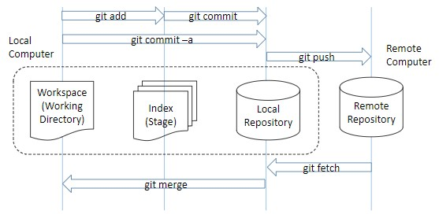
  * git pull: git fetch + git merge
  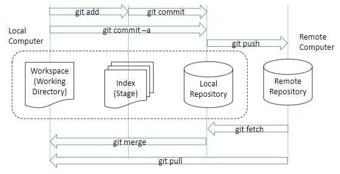
  * git diff HEAD: workspace와 local repository 사이의 변경 내용을 비교  
  git diff: workspace와 index 사이, 또는 index와 local repository 사이의 변경 내용을 비교
  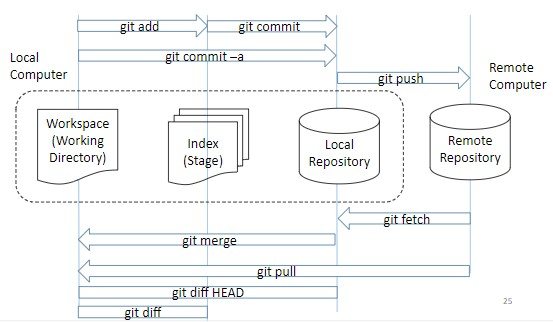

-------------
### Week2-3 Github, fork, pull request
* Git 실습
  * Git 상태확인 명령어
    1. git show
    2. git log
    3. git shortlog
    4. git diff
    5. git status
  * git push origin master  
    origin: 원격 저장소  
    master: 로컬 브랜치
  * git reset  
    : 실수로 git add한 파일 목록 취소
  * git reset HEAD~1  
    : 최근의 commit을 취소하고 이전 commit으로 돌아가는 작업을 수행하는 명령어 
  * Fork & Pull request
    * Fork  
    : 다른 개발자의 원격 저장소를 자신의 계정으로 복제
    * Pull request  
    : fork한 저장소에서 원본 프로젝트로 변경 내용을 제안하고 통합을 요청하는 과정
    * Fork & Pull request로 인한 버전 정보 이동  
    : 원격 저장소 => 원격 저장소

-------------
### Week3     Markdown
* Markdown
  : 일반 텍스트 에디터(plain-text editor)를 사용하여 서식 있는 텍스트를 생성하는 데 사용되는 경량 마크업 언어  
[Markdown tutorial!](https://www.markdowntutorial.com/)
  1. _Italics_ and **Bold**
    * _Italics_: 글자의 바깥쪽에 밑줄(_) 추가
    * **Bold**: 글자의 바깥쪽에 별표(**) 추가
  2. Headers
    : 해쉬 마크(#)를 문단 앞에 사용  
    (ex) 헤더 1 = (# 헤더 1)  
    헤더 3 = (### 헤더 3)
  3. Links  
    : 링크할 텍스트를 대괄호([])로 싼 다음, 링크할 주소를 소괄호(())로 감싸기  
    (ex) [GitHub 방문!](www.github.com)
  4. Images
    : 앞에 느낌표(!)를 입력하고, 대괄호([])로 대체 텍스트를 감싼 다음, 소괄호(())로 링크를 감싸기  
    (ex) 
  5. Blockquotes
    : 인용문을 사용하기 위해, 문장 앞에 "~보다 큰" 의미를 가진 캐럿 기호(>) 붙이기
  6. Lists
    : 리스트를 생성하기 위해, 리스트의 각 항목에 별표(*)를 앞에 붙이기  
  7. Paragraphs
    * 문단 나눔: space바 두번 누르기
    * 줄 나눔: 각 줄의 끝에 점(.) 두 개 찍기
    
